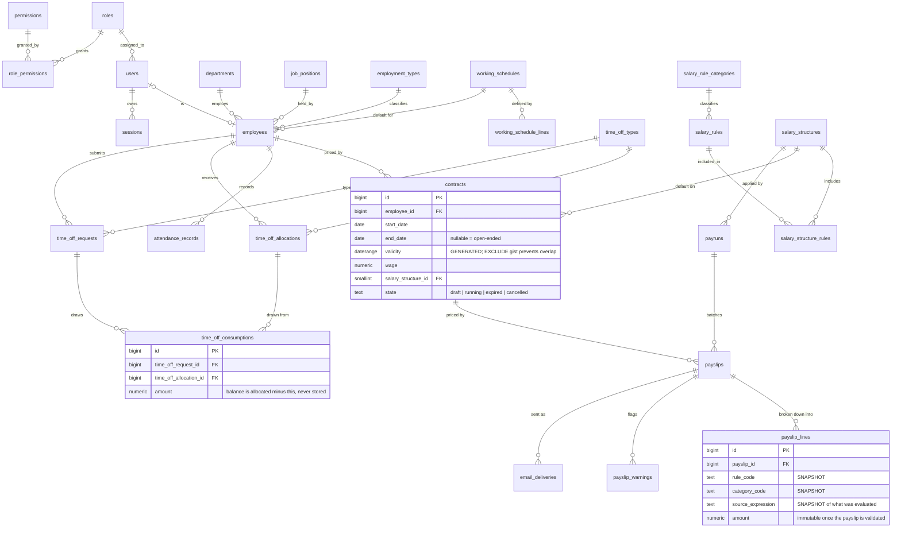

# PeoplePay360 — HR & Payroll

An integrated HR and payroll platform: employee master data, contracts, working
schedules, attendance, time off, a salary rules engine, payruns, payslip PDFs,
bulk email delivery and a dashboard — over a PostgreSQL schema that enforces the
domain's temporal rules itself.

---

## The idea

An employee's pay is not stored. It is **derived**, on a date, from a chain of
records that each change over time — and the job of this system is to make that
derivation correct, explainable, and permanently frozen once money moves.

```
employee  →  contract valid for the period      →  wage + salary structure
                        +
             working schedule                   →  scheduled days and hours
                        +
             attendance in period               →  worked days, hours, exceptions
                        +
             approved time off in period        →  paid days, unpaid days
                        ↓
             salary rules executed in sequence
                        ↓
             payslip lines: Basic → Allowances → Gross → Deductions → Net
                        ↓
             warnings → validate → mark paid → PDF → email
                        ↓
             frozen history, aggregated live by the reporting endpoints
```

---

## Where the interesting engineering is

### Temporal integrity lives in the schema

Payroll must use only the contract valid for the period being paid, and an
employee must never have two contracts in force at once. That is a temporal
integrity rule, so it is declared in the database rather than left to a
validator someone can forget to call:

```sql
validity daterange GENERATED ALWAYS AS (daterange(start_date, end_date, '[]')) STORED,

CONSTRAINT contract_no_overlap EXCLUDE USING gist (
  employee_id WITH =,
  validity    WITH &&
) WHERE (state IN ('running', 'expired'))
```

The `WHERE` predicate is what makes it usable: exclusivity applies to contracts
that are *real*, so HR can prepare a replacement while the outgoing one still
runs. Two further exclusion constraints do the same job for attendance — nobody
is in two places at once — and for approved leave.

Derived time is computed by the database too. `worked_minutes` per schedule line
and `worked_hours` per attendance record are generated columns, and a schedule's
weekly hours are maintained by a trigger over its lines. Weekly hours are never
accepted from a client, because there is no column to accept them into.

### A salary rules engine, not a formula column

Rules execute in sequence, and the sequence is a **dependency declaration**:
rule *n* may read the results of rules *1…n−1* and nothing later. Results become
visible under two namespaces, which is what lets a Gross rule read
`categories.ALW` without knowing which allowances a structure happens to contain.

The seeded *Regular Salary* structure exercises every computation type:

| Seq | Code | Category | Type | Definition |
|---|---|---|---|---|
| 10 | `BASIC` | BASIC | formula | `contract.wage * (worked.paid_days / worked.scheduled_days)` |
| 20 | `HRA` | ALW | percentage | 40% of `BASIC` |
| 30 | `CONV` | ALW | fixed | 1600 |
| 40 | `OT` | ALW | formula | conditional on `worked.overtime_hours > 0` |
| 50 | `GROSS` | GROSS | formula | `categories.BASIC + categories.ALW` |
| 60 | `PF` | DED | formula | `min(rules.BASIC * 0.12, 1800)` |
| 70 | `PT` | DED | fixed | 200 |
| 80 | `LWP` | DED | formula | unpaid leave becomes loss of pay |
| 90 | `NET` | NET | formula | `categories.GROSS - categories.DED` |

The engine is pure — rules in, lines out, no database — so it is testable on its
own and reusable for a rule-preview feature.

Every rule's result is rounded to two decimals the moment it is computed, and the
rounded value is what later rules read. Rounding once at the end instead would
let the printed lines fail to sum to the printed total, which is the one failure
a payslip cannot survive.

### No `eval`, structurally

Salary rules are text a user types into a configuration screen, and this is the
module that stops that text from becoming executable JavaScript. There is no
`eval`, no `new Function`, no `vm`, and no property access on any host object.

Variables resolve from a **flat `Map`** of dotted names to numbers, not from an
object graph. There is no traversal to hijack, so `constructor.constructor` and
`__proto__.x` are not dangerous constructs needing a blocklist — they are keys
nobody put in the Map, and they fail as ordinary unknown-variable typos. The test
suite asserts exactly that for six known escapes.

Parsing enforces a 200-node and 32-depth budget, so a pathological expression
costs bounded work before evaluation begins. `if()` and the boolean operators
short-circuit, so a guarded division never evaluates its untaken branch.

### Finalized payroll is immutable, below the application

`payslip_lines` snapshot the rule code, name, category and the expression that was
evaluated, so reading a September payslip never touches October's configuration.
Triggers then refuse to change lines or header money once validated, permitting
only the `validated → paid` transition. Application code could enforce this; the
database enforcing it means a bug in application code *cannot* rewrite history.

Duplicate payslips across runs are a warning while everything is draft, and a
partial unique index makes them impossible at the moment of finalization.
Warnings are for humans; constraints are for money.

### Access control that survives a curious URL

Authorisation answers two questions, and answering only the first is the classic
failure: *may this role touch the resource*, and *which rows are theirs*. A role
holds a permission at scope `own` or `all`, and `own` becomes a `WHERE` clause —
so an Employee listing employees gets **one row from the database**, not sixty
rows filtered afterwards.

Routes are registered through a guarded router with no overload that omits a
permission code, which makes "every protected route is checked" a property of the
type system rather than a rule to remember.

Verified against seeded data: unauthenticated is 401; an Employee sees only their
own record; the same Employee editing the id in the URL gets 403 with a message
saying why; an HR Manager sees every employee and has no payroll reach at all.

---

## Stack, and why

| Layer | Choice | Reasoning |
|---|---|---|
| Database | **PostgreSQL 16** | Chosen for features actually used here: `daterange`, `EXCLUDE USING gist`, generated columns, partial unique indexes. This domain is made of range overlaps and ordered computation. |
| DB access | **`pg` driver, SQL written directly** | No ORM. The schema is the most important artefact in the project, and an ORM hides it. Every query in the repository is one that can be explained. |
| Migrations | **Numbered `.sql` files + a small runner** | Forward-only, checksummed, each applied in its own transaction. Editing an applied migration fails loudly rather than letting two machines diverge silently. |
| Runtime | **Node 24 + TypeScript, executed natively** | Node runs `.ts` directly — no build step, no bundler, no `ts-node`. Static types at zero tooling cost and no build to break under pressure. |
| API | **Express 5** | The smallest thing that routes. Express 5 forwards async errors natively, so there is no `asyncHandler` wrapper anywhere. |
| Auth | **Opaque session tokens in Postgres** | Not JWT. Revocable, no signing key to leak, and only the SHA-256 hash is stored. Password hashing uses `node:crypto` scrypt, so there are no auth dependencies and nothing to compile at install time. |
| Validation | **Zod schemas in `shared/`** | One definition the API and any client can both import, so an invalid email produces the same sentence on both sides rather than two that drift. |
| Formulas | **A purpose-built lexer, Pratt parser and evaluator** | See above. ~250 lines, 34 tests. |
| PDF | **PDFKit** | Pure JS, no headless browser. Generating sixty payslips for a bulk send is the same code path as printing one. |
| Email | **Nodemailer → Mailpit** | Real SMTP, real MIME, real attachments, and no third-party mail provider. Works with the network unplugged. |
| Client | **React 19 + Vite + React Router** | Standard and fast. No state library — this application's server state is shallow, and forty lines of fetching hook beats a cache whose semantics would need defending. |
| Styling | **CSS against design tokens, with our own primitives** | No component library. Seven primitives — table, toolbar, field, status bar, smart button, panel, badge — make every list and form behave identically across all six modules. |
| Charts | **SVG drawn directly** | Two chart shapes are all the dashboard needs; it keeps the palette identical to the rest of the interface and removes a dependency. |
| Tests | **`node:test`** | Built into the runtime. No test framework, no configuration. |

Nine production dependencies: `express`, `pg`, `zod`, `pdfkit`, `nodemailer`,
`react`, `react-dom`, `react-router`, `vite`.

---

## Data model

27 tables · 5 views · 3 exclusion constraints · 160+ constraints · 90+ indexes · 11 triggers



`time_off_consumptions` is the table worth pointing at. Leave balance is never
stored as a counter — it is `allocated − SUM(consumed)`, so a request spanning
two allocations produces two visible rows, and refusing a previously approved
request restores the balance by deleting them, with no compensating update to get
wrong.

---

## Running it

Requires **PostgreSQL 16+** and **Node 22.6+** (24 recommended). Docker is
optional and provides the mail sink.

```bash
git clone <repo>
cd peoplepay360
npm install

cp .env.example .env          # adjust PGUSER / PGPASSWORD for your machine
createdb peoplepay360

docker compose up -d mailpit  # optional: SMTP sink at http://localhost:8025

npm run db:migrate
npm run db:seed

npm run dev:server            # API → http://localhost:4000
npm run dev:web               # UI  → http://localhost:5173
```

The dev server proxies `/api` to the backend, so the session cookie stays
first-party and no CORS negotiation is needed in development.

### Seeded data

60 employees · 84 contracts, a third of them with more than one so contract
history is non-trivial · ~4,800 attendance records including deliberate late
arrivals, absences, forgotten check-outs and authorised corrections · 225
allocations · 202 leave requests · three months of finalized payroll, produced by
running the real engine rather than by inserting numbers.

Two employees have no bank details on purpose, so the `MISSING_BANK` warning
fires against real data.

All demo accounts share the password `Password123!`:

| Email | Role |
|---|---|
| `admin@peoplepay360.local` | Admin — everything, plus user management |
| `payroll.manager@peoplepay360.local` | HR Payroll Manager — payroll and salary rules |
| `payroll.user@peoplepay360.local` | HR Payroll User — payroll; config read-only |
| `hr.manager@peoplepay360.local` | HR Manager — HR only, no payroll |
| `employee@peoplepay360.local` | Employee — own records only |

### Commands

```bash
npm test              # 103 unit tests: expression evaluator and its static
                      # checker, rules engine, leave consumption, row-level
                      # authorisation, login throttle, period and money arithmetic
npm run typecheck     # tsc --noEmit across server, shared and db
npm run verify:flows  # drives both end-to-end flows over real HTTP (23 checks)
npm run db:reset      # rebuild the schema and reseed from scratch
```

`db:reset` drops every table, so it refuses to run when `NODE_ENV=production`,
and refuses non-interactively unless you name the target explicitly:

```bash
CONFIRM_RESET_DATABASE=peoplepay360 npm run db:reset
```

CI runs typecheck, tests and a production build on every push, plus the flow
script against a real Postgres service — see `.github/workflows/ci.yml`.

`verify:flows` needs the API running. It reserves fresh payroll periods from live
history on each run, so it is safe to run repeatedly.

---

## API surface

All routes are under `/api/v1`, return snake_case JSON matching the schema, and
sit behind authentication plus a permission check.

```
POST   /auth/login · POST /auth/logout · GET /auth/me

GET    /employees                    ?q&department_id&status&employment_type_id&page&sort
GET    /employees/:id                includes smart-button counts in one round trip
POST   /employees · PATCH /employees/:id · DELETE /employees/:id

CRUD   /contracts · /working-schedules · /attendance
PATCH  /attendance/:id               requires attendance:correct and a reason

CRUD   /time-off/types · /time-off/allocations · /time-off/requests
POST   /time-off/requests/:id/approve | /refuse    ← consumption happens here
POST   /time-off/allocations/:id/approve
GET    /time-off/balances?employee_id

CRUD   /salary/structures · /salary/rules          ← read-only for hr_payroll_user
POST   /payruns/eligible-employees                 ← preview; creates nothing
POST   /payruns
POST   /payruns/:id/compute | /validate | /mark-paid | /send-payslips
GET    /payslips · /payslips/:id · /payslips/:id/pdf

GET    /dashboard?period_start&period_end&department_id&employment_type_id
```

The payrun endpoints are split deliberately: choosing a scope and choosing
employees are both client state, `/payruns/eligible-employees` is a read-only
preview, and the batch only comes into existence on `POST /payruns` — which
re-checks the selection server-side, because the list the client saw could be
minutes old and a payslip for someone already paid is an expensive mistake.

---

## Layout

```
db/
  migrations/     forward-only, numbered, checksummed
  seeds/          reference data, people, operations, payroll history
  migrate.ts      the runner
shared/
  schemas/        zod schemas shared with any client
server/src/
  routes/         HTTP only — parse, call a service, shape a response
  services/       business logic, zero express imports
    payroll/        rule_engine · contract_resolver · context_builder · warnings
      expression/     lexer · parser · evaluator
    time_off/       consumption
  repositories/   SQL only, zero business logic
  middleware/     authenticate · authorize · validate · error_handler
  pdf/ · mail/ · errors/ · lib/
  test/
web/src/
  app/            router, shell, breadcrumb
  components/     the shared primitives
  features/       one page per module
  lib/            api client, auth context, formatters
  styles/         tokens.css, base.css
scripts/          verify_demo_flows.mjs
```

Three layers, stated so they stay honest: **routes** know HTTP and nothing else;
**services** know business rules and nothing about HTTP; **repositories** know SQL
and nothing about business rules.

### Interface

The design is drawn from the artifact the product exists to produce. A payslip is
an accounting document, so colour is semantic rather than decorative: earnings run
petrol-blue and ochre, a subtotal is structural so it takes slate, deductions are
brick, and net pay is the only green on the page. An accountant reads the column
before the number, and the colour is that column.

Navigation is filtered by permission so a role never sees a menu that would 403 —
an HR Manager, who has no payroll access, has no Payroll menu. That is
presentation only; the server re-checks every route independently.

---

## What would come next

- **Payslip segments for a mid-period contract change.** Today pay is priced on
  the contract in force at period end, with a warning that a change happened. The
  fuller version splits the payslip into two prorated segments; the schema already
  supports it.
- **Retroactive adjustment as a first-class record.** Approving leave for a period
  already paid currently surfaces as an alert. A complete system issues a
  correction on the next payrun that references the original.
- **Materialized dashboard aggregates** with a refresh policy, once payroll
  history outgrows what plain views serve comfortably.
- **Rule preview** — run a structure against one employee and show the lines
  before committing a configuration change. The engine is already pure, so this is
  an endpoint rather than a rewrite.
- **Hourly-wage contracts** end to end. The column exists; the engine branch does not.

---

## Notes for anyone reading the code after the audit pass

A full review of this codebase produced 118 findings, which were then worked
through on `fix/audit-findings`. `AUDIT_PROGRESS.md` tracks them individually.
Four behaviours changed in ways worth knowing before you use the system:

**Leave duration is derived, not submitted.** A time-off request no longer
carries a `requested_amount`. The server counts the scheduled working days
between the two dates, because balance consumption and the payroll leave count
were previously computed from different inputs and could disagree — a month-long
request declared as half a day cost half a day of balance and produced a month of
paid leave. A consequence: a request covering only non-working days is refused,
since it contains no leave to take.

**`NO_SCHEDULE` is a blocker.** An employee with no working days in the period
cannot have a payslip computed, so the payrun now refuses to validate rather than
finalising around them. Previously it was a warning, the payslip stayed in draft,
the mailer skipped it, and the person was simply not paid.

**Payslip PDFs print `INR 1,23,456.50`.** PDFKit's built-in Helvetica has no
glyph for `₹` and was silently drawing a superscript one in its place, on every
amount of every payslip. The screen still shows the symbol.

**A payrun read is scoped.** `GET /api/v1/payruns` and `/payruns/:id` now filter
to the caller's own payslips when their role holds `payrun:read` at scope `own` —
which the Employee role does. Before, any signed-in employee could read every
colleague's salary by opening the Payroll tab.

Two limitations are known and deliberately left in place, both recorded in
`AUDIT_PROGRESS.md`:

- A contract change mid-period pays only the days the surviving contract covers.
  The warning now says so explicitly, and the earlier days need a separate payrun.
  Splitting a payslip into per-contract segments is a change to the money path
  that wants its own review.
- Attendance does not drive pay: a scheduled day with neither attendance nor
  approved leave is still paid. That is a policy choice, and it now raises an
  `UNEXPLAINED_ABSENCE` warning so it is a visible one.
