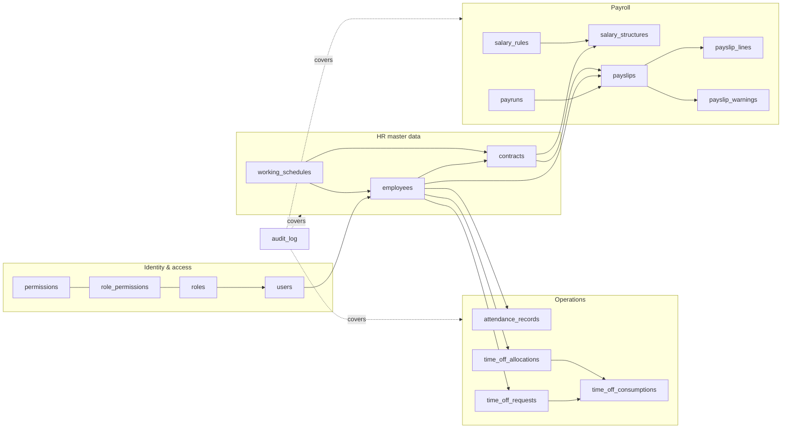

# PeoplePay360 — HR & Payroll

An integrated HR and payroll platform: employee master data, contracts, working
schedules, attendance, time off, a salary rules engine, payruns, payslip PDFs,
bulk email delivery, and a dashboard that aggregates all of it live.

Built for the Odoo Hackathon 2026 Grand Finale against the **PeoplePay360: HR &
Payroll** problem statement.

---

## The problem, as we read it

An employee's pay is not stored — it is **derived**, on a date, from a chain of
records that each change over time. The platform's job is to make that
derivation correct, explainable, and permanently frozen once money moves.

That reading drove every significant decision below. The full analysis, the ERD,
the ambiguities we resolved and the questions we would put to a mentor are in
**[`plan.md`](plan.md)**, written before any code existed.

```
employee  →  contract valid for the period      →  wage + salary structure
                        +
             working schedule                   →  scheduled days and hours
                        +
             attendance in period               →  worked days, hours, exceptions
                        +
             approved time off in period        →  paid days, unpaid days
                        ↓
             salary rules executed in sequence
                        ↓
             payslip lines: Basic → Allowances → Gross → Deductions → Net
                        ↓
             warnings → validate → mark paid → PDF → email
                        ↓
             frozen history; the dashboard aggregates over it
```

---

## Stack, and why

| Layer | Choice | Reasoning |
|---|---|---|
| Database | **PostgreSQL 16, run locally** | Chosen for features we actually use: `daterange`, `EXCLUDE USING gist`, generated columns, partial unique indexes. This problem is *made of* range overlaps and ordered computation. |
| DB access | **`pg` driver + hand-written SQL** | No ORM. Database design is the highest-weighted criterion and an ORM hides exactly the artefact being graded. Every query in the repo is one we can explain. |
| Migrations | **Numbered `.sql` + a 90-line runner we wrote** | Forward-only, checksummed, each in its own transaction. Short enough to read in one sitting; one fewer tool in the story. |
| Backend | **Node 24 + TypeScript, run natively** | Node 24 executes `.ts` directly — no build step, no bundler, no `ts-node`. Static types at zero tooling cost and no build to break at hour 22. |
| API | **Express 5** | The smallest thing that routes. Express 5 forwards async errors natively, so there is no `asyncHandler` wrapper. |
| Auth | **Opaque session tokens in Postgres** | Not JWT. Revocable, no signing key to leak, and only the SHA-256 hash is stored. Hashing uses `node:crypto` scrypt — zero auth dependencies. |
| Validation | **Zod, in `shared/`, imported by both sides** | One definition means the browser's message and the server's message are the same string rather than two that drift. |
| Formula evaluation | **Our own lexer → Pratt parser → evaluator** | No `eval`, no `new Function`, no library. ~250 lines, 34 tests. See below. |
| Frontend | **React 19 + Vite + React Router** | Standard and fast. No state library — this app's server state is shallow. |
| Styling | **Hand-written CSS with design tokens** | Odoo's real tokens describe a *dense* UI that component libraries fight. Seven primitives we wrote make every list and form behave identically. |
| Charts | **Hand-drawn inline SVG** | Two chart shapes are all the dashboard needs; keeps the palette identical and removes a dependency. |
| PDF | **PDFKit** | Pure JS, no headless browser. Generating 60 payslips for a bulk send is the same code path as printing one. |
| Email | **Nodemailer → Mailpit** | Real SMTP, real MIME, real attachments, **no third-party mail provider**. Works with the network unplugged. |
| Tests | **`node:test`** | Built in. No Jest, no config. |

**Nine production dependencies:** `express`, `pg`, `zod`, `pdfkit`, `nodemailer`,
`react`, `react-dom`, `react-router`, `vite`.

---

## Where the interesting engineering is

### 1. Temporal integrity, enforced by the schema

The spec requires payroll use only the contract valid for the period and forbids
concurrent active contracts. That is a temporal integrity rule, so it is declared
in the database rather than left to a validator someone can forget to call:

```sql
validity daterange GENERATED ALWAYS AS (daterange(start_date, end_date, '[]')) STORED,

CONSTRAINT contract_no_overlap EXCLUDE USING gist (
  employee_id WITH =,
  validity    WITH &&
) WHERE (state IN ('running', 'expired'))
```

The `WHERE` predicate is the part that makes it usable: exclusivity applies to
contracts that are *real*, so HR can prepare a replacement while the outgoing one
still runs. Two more exclusion constraints do the same job for attendance (nobody
is in two places at once) and approved leave.

Derived time is computed by the database too — `worked_minutes` per schedule line
and `worked_hours` per attendance record are generated columns, and a schedule's
weekly hours are maintained by a trigger over its lines. The spec says weekly
hours must be calculated, never typed in; here there is no column to type into.

### 2. A salary rules engine, not a formula column

Rules execute in sequence, and the sequence is a **dependency declaration**: rule
*n* may read the results of rules *1…n−1* and nothing later. Results become
visible under two namespaces, which is what lets a Gross rule read
`categories.ALW` without knowing which allowances a structure contains.

The seeded *Regular Salary* structure exercises every computation type:

| Seq | Code | Category | Type | Definition |
|---|---|---|---|---|
| 10 | `BASIC` | BASIC | formula | `contract.wage * (worked.paid_days / worked.scheduled_days)` |
| 20 | `HRA` | ALW | percentage | 40% of `BASIC` |
| 30 | `CONV` | ALW | fixed | 1600 |
| 40 | `OT` | ALW | formula | conditional on `worked.overtime_hours > 0` |
| 50 | `GROSS` | GROSS | formula | `categories.BASIC + categories.ALW` |
| 60 | `PF` | DED | formula | `min(rules.BASIC * 0.12, 1800)` |
| 70 | `PT` | DED | fixed | 200 |
| 80 | `LWP` | DED | formula | unpaid leave → loss of pay |
| 90 | `NET` | NET | formula | `categories.GROSS - categories.DED` |

`LWP` is the line that makes the second demo flow land: allocate leave → request
→ approve → the deduction appears on the payslip. One number, four modules.

### 3. No `eval`, structurally

Salary rules are text a user types into a configuration screen. The evaluator
resolves variables from a **flat `Map`** of dotted names to numbers — not an
object graph. There is no traversal to hijack, so `constructor.constructor` and
`__proto__.x` are not dangerous constructs needing a blocklist; they are keys
nobody put in the Map, and they fail as ordinary unknown-variable typos. The test
suite asserts exactly that for six known eval escapes.

Parsing enforces a 200-node and 32-depth budget, so a pathological expression
costs bounded work before evaluation begins.

### 4. Finalized payroll is immutable, below the application

`payslip_lines` snapshot the rule code, name, category and the expression that was
evaluated, so reading a September payslip never touches October's configuration.
Triggers then refuse to change lines or header money once validated, permitting
only the `validated → paid` transition. Application code could enforce this; the
database enforcing it means a bug in application code *cannot* rewrite history.

### 5. Role-based access that survives a curious URL

Authorisation answers two questions, and answering only the first is the classic
failure: *may this role touch the resource*, and *which rows are theirs*. A role
holds a permission at scope `own` or `all`, and `own` becomes a `WHERE` clause —
so an Employee listing employees gets **one row from the database**, not sixty
rows filtered afterwards.

Routes are registered through a guarded router with no overload that omits a
permission, making "every protected route is checked" a property of the type
system rather than a rule to remember.

Verified live: unauthenticated → 401; an Employee sees only their own record; the
same Employee editing the id in the URL → 403 with a message saying why; HR
Manager sees all 60 and has no payroll access at all.

---

## Schema

Full ERD with columns, types and constraints: **[`plan.md`](plan.md#the-data-model)**.

27 tables · 5 views · 3 exclusion constraints · 160+ constraints · 90+ indexes · 11 triggers



---

## Running it

Requires **PostgreSQL 16+** and **Node 22.6+** (24 recommended). Docker is optional
but gives you the mail sink.

```bash
git clone <repo> && cd peoplepay360
npm install

cp .env.example .env          # adjust PGUSER / PGPASSWORD for your machine
createdb peoplepay360

docker compose up -d mailpit  # optional: SMTP sink at http://localhost:8025

npm run db:migrate            # apply migrations
npm run db:seed               # seed a realistic company

npm run dev:server            # API   → http://localhost:4000
npm run dev:web               # UI    → http://localhost:5173
```

Or bring the whole thing up with `docker compose up`.

### Sign in

All demo accounts share the password `Password123!`:

| Email | Role | What they can reach |
|---|---|---|
| `admin@peoplepay360.local` | Admin | Everything, plus user management |
| `payroll.manager@peoplepay360.local` | HR Payroll Manager | All HR and payroll, including salary rules |
| `payroll.user@peoplepay360.local` | HR Payroll User | Payroll records; salary config read-only |
| `hr.manager@peoplepay360.local` | HR Manager | All HR — **no payroll at all** |
| `employee@peoplepay360.local` | Employee | Own records only |

Signing in as two different roles and comparing what the top navigation offers is
the fastest way to see the permission model is real.

### What the seed contains

60 employees · 84 contracts (a third have more than one, so contract history is
non-trivial) · ~4,800 attendance records with deliberate lates, absences,
forgotten check-outs and manual corrections · 225 allocations · 202 leave
requests · 3 months of finalized payroll produced by the real engine.

Two employees have no bank details **on purpose**, so the `MISSING_BANK` warning
fires during the demo rather than being described.

### Commands

```bash
npm test              # 66 unit tests: expression evaluator, rules engine,
                      # leave consumption, row-level authorisation
npm run typecheck     # tsc --noEmit across server, web, shared and db
npm run verify:flows  # drives both demo flows over real HTTP (23 checks)
npm run db:reset      # rebuild the schema and reseed from scratch
```

---

## The two demo flows

**Employee → payslip.** Employees → open a record → smart buttons to contracts,
attendance, time off → Payroll → New payrun → step 1 scope, step 2 employee
selection → Create → Compute → read the warnings → Validate → Mark paid → open a
payslip → Print PDF → Send payslips → open Mailpit and watch them arrive.

**Leave allocation → request → approved → reflected in payroll.** Time Off →
Allocations → grant and approve → Requests → create an *unpaid* request → Approve
→ watch the balance move and see which allocation it drew from → run a payrun for
that period → the `LWP` deduction appears on the payslip, and basic pay is
prorated.

---

## What we would build next

- **Payslip segments for a mid-period contract change.** Today we price on the
  contract in force at period end and warn that a change happened. The honest
  version splits the payslip into two prorated segments; the schema already
  supports it (`payslip_lines` would carry their own `contract_id`).
- **Retroactive adjustment as a first-class record.** Approving leave for a period
  already paid currently surfaces as a dashboard alert. A real system issues a
  correction on the next payrun that references the original.
- **Materialized dashboard aggregates with a refresh policy**, once payroll
  history outgrows what plain views serve comfortably.
- **Rule preview**: run a structure against one employee and show the lines before
  committing a configuration change. The engine is already pure, so this is a
  screen rather than a rewrite.
- **Hourly-wage contracts** end to end. The column exists; the engine branch does not.

---

## Repository layout

```
db/           migrations (forward-only), seed modules, migration runner
shared/       zod schemas imported by BOTH server and web
server/src/
  routes/       HTTP only — parse, call a service, shape a response
  services/     business logic, zero express imports
    payroll/      rule_engine · contract_resolver · warnings · expression/
  repositories/ SQL only, zero business logic
  middleware/   authenticate · authorize · validate · error_handler
web/src/
  components/   the seven shared primitives
  features/     one folder-free page per module
  lib/          api client, auth context, formatters
scripts/      verify_demo_flows.mjs — both flows over real HTTP
```

Three-layer rule, stated so four people obey it: **routes** know HTTP and nothing
else; **services** know business rules and nothing about HTTP; **repositories**
know SQL and nothing about business rules.

---

## Team

| Member | Owned |
|---|---|
| _(fill in)_ | Schema, migrations, contract resolution |
| _(fill in)_ | Rules engine, expression evaluator, payrun lifecycle |
| _(fill in)_ | Design system, employee and time-off screens |
| _(fill in)_ | Payroll screens, dashboard, PDF and mail |

Every member commits their own work and presents the part they built.
