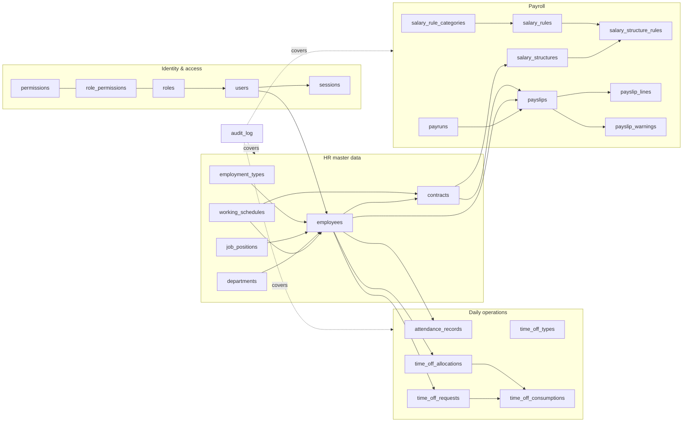
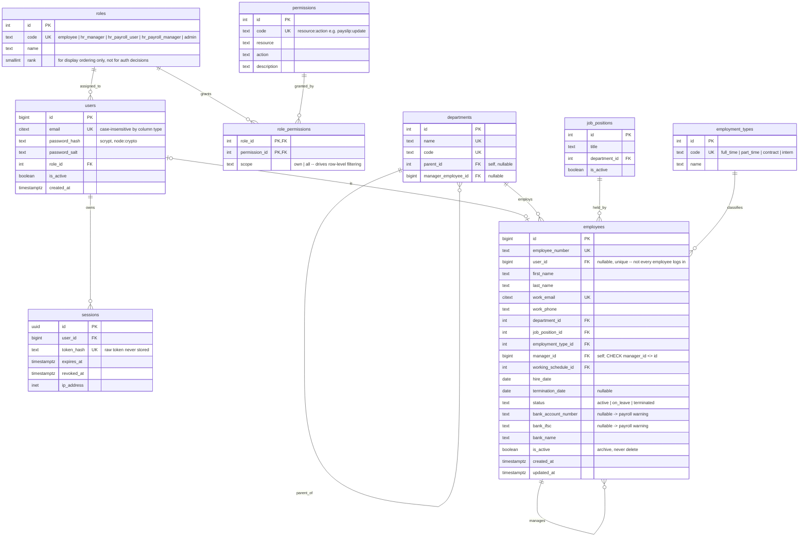
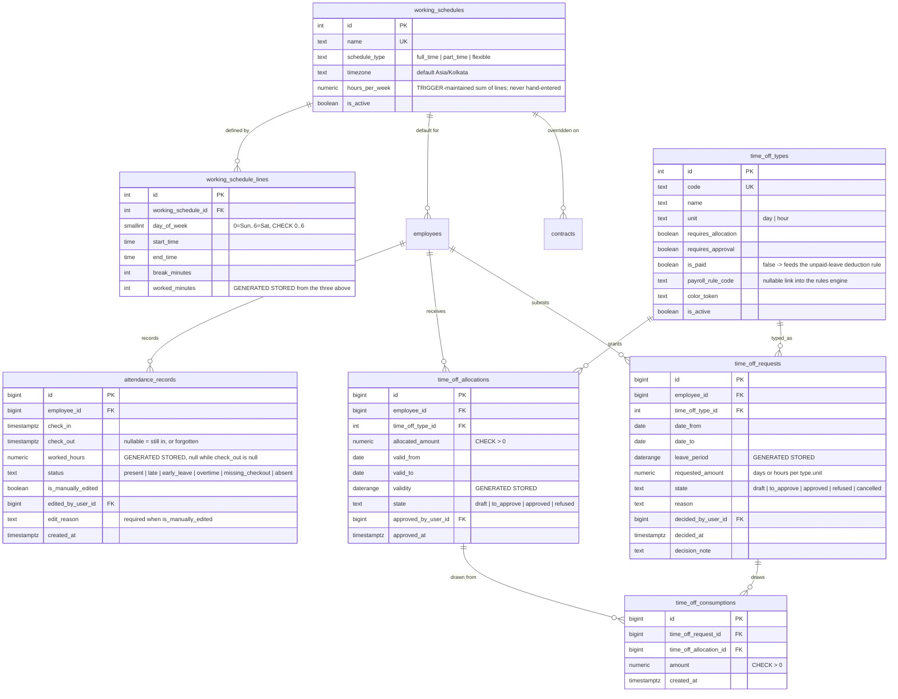
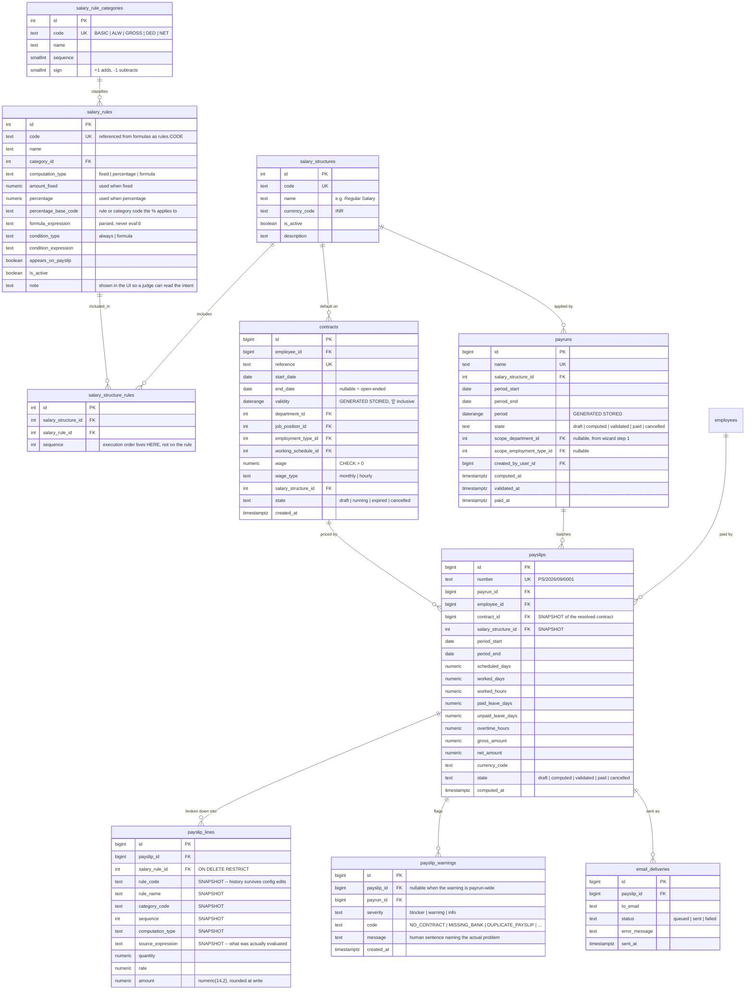

# PeoplePay360 — Build Plan

**Team:** 4 engineers · **Event:** Odoo Hackathon 2026 Grand Finale, Gandhinagar · **Window:** 24h from 09:00 IST, 5 Sept 2026
**Status:** written before any source file exists. Nothing has been scaffolded yet.

---

## What I understood from the problem statement

### The one-sentence version

An employee's pay is not stored — it is **derived**, on a date, from a chain of records that each change over time; the system's job is to make that derivation correct, explainable, and permanently frozen once money moves.

### The system as I read it

Most HR tools keep employees, attendance, leave and salary in four unrelated tables and call it done. This problem is explicitly the opposite: it asks for the **join** between them. The Employee record is a hub, but it deliberately carries almost no payroll truth itself. Everything payroll needs is reached through a *time-qualified* relationship:

- An employee has **many contracts over their life**, but exactly **one that applies to a given payroll period**. The wage on the payslip comes from that contract, not from the employee.
- An employee's expected hours come from a **working schedule** — a weekly pattern of day/start/end/break rows — and the weekly-hours figure is a *consequence* of those rows, never typed in.
- **Attendance** records actual presence, and is expected to be imperfect: late arrivals, missing check-outs, absences, manual corrections by authorised staff. It is evidence, not gospel.
- **Time off** is a two-sided ledger: **allocations** grant balance, **requests** consume it, and only *approved* requests consume. Balance is `granted − consumed`, and it must be visible *which* allocation a given request ate into.
- **Salary structures** are ordered bags of **salary rules**. Rules are the program; the payslip is the program's output. Rules run in sequence because later rules read earlier rules' results — Gross cannot be computed before Allowances exist.
- A **payrun** is a batch job over a period: pick a structure and period, pick employees, compute, review warnings, validate, mark paid, distribute. A **payslip** is one employee's result inside that batch.

So the operational flow, stated as a pipeline:

```
employee  →  contract valid for the period  →  wage + structure
                      +
          working schedule  →  scheduled days/hours for the period
                      +
          attendance in period  →  actual worked days/hours, exceptions
                      +
          approved time off in period  →  paid days, unpaid days
                      ↓
          salary rules of the structure, executed in sequence
                      ↓
          payslip lines (Basic → Allowances → Gross → Deductions → Net)
                      ↓
          warnings → validate → mark paid → PDF → email
                      ↓
          frozen historical record; dashboard aggregates over it
```

### What I believe the hard parts actually are

Ranked by how likely they are to be where we lose or win the round.

**1. Temporal correctness — "which contract applies?"**
This is the spine, and it is subtle. "The contract valid for the period" is a range-overlap question, not an `is_active` boolean. If two contracts for one employee can overlap, payroll becomes ambiguous and every downstream number is unjustifiable. The spec words it as "avoiding concurrent active contracts" — that is a **temporal integrity constraint**, and the honest place to enforce it is the database, not a validator someone can forget to call. Corollary: a period can legitimately *not* be fully covered by one contract (someone joins on the 12th), so proration must exist and must be principled.

**2. Rule sequencing is a dependency graph pretending to be a number.**
`sequence` looks like a sort order. It is really a declaration that rule *n* may read the results of rules *1…n−1* and nothing later. That makes the engine a tiny interpreter with a growing, read-only context. Two consequences most teams miss: (a) percentage-of and formula rules need a **resolvable reference** to earlier results — both individual rule codes *and* running category totals; (b) formulas are user-supplied text, so evaluating them is a **security surface**, not a convenience. `eval()` here is a straight fail on a criterion Odoo names out loud.

**3. Immutability of finalized payroll.**
A payslip is a financial record. If someone edits the HRA rule in October, September's validated payslips must not silently change — but a naive implementation joins to `salary_rules` at read time and *does* change them. The fix is to **snapshot** the computed lines (rule code, name, category, amount, the expression used) at compute time and refuse writes afterwards. This is the difference between a demo and a system.

**4. Leave balance consumption that is auditable, not just arithmetic.**
"Approved requests automatically deduct from allocations" is easy to fake with a counter. The spec's phrase is "accurately consumed and **transparently linked**". That asks for the link to be a record: *this* request consumed *this much* from *that* allocation. It also raises real cases — a request spanning two allocations, a refusal after approval, a request crossing the allocation's validity window.

**5. Warnings before finalization.**
The spec asks the system to be *suspicious of itself*: missing bank details, duplicate payslips, incomplete employee data, contract attention items. That means an explicit, named, stored warning taxonomy with severities — not a `console.warn`.

**6. Role-based access that survives a curious URL.**
Five roles, and the boundaries are precise: HR Manager has full HR CRUD and **zero** payroll; HR Payroll User adds payroll CRU but read-only config; HR Payroll Manager adds config CRUD. An Employee sees only *their own* records. Note that this is two different mechanisms — *can you touch this resource at all* (route-level) and *which rows of it are yours* (query-level). Only doing the first is the classic failure.

**7. A dashboard that is a query, not a fixture.**
Every KPI on B9 must be an aggregate over the rows the rest of the app writes. This is only hard if the schema is wrong; it is nearly free if the schema is right. That is itself the argument for spending our first hours on the schema.

### What I explicitly do *not* think this problem is

It is not a CRUD-screens exercise, and it is not a UI beauty contest. The PDF says so twice ("goes beyond simple employee CRUD screens", "not on any specific platform or vendor"). Screens are the *evidence* that the model works. We build the model first.

---

## Build ideas, plans

### Stack, and why

Every choice below is one I can defend in a sentence, because I expect to be asked to.

| Layer | Choice | Why this, and not the obvious alternative |
|---|---|---|
| Database | **PostgreSQL 16, local** | Mandated in spirit by Odoo's briefing (Firebase/Supabase/Mongo Atlas named as wrong answers). More concretely: this problem is *made of* range overlaps and ordered computation, and Postgres has `daterange`, `EXCLUDE USING gist`, generated columns and partial unique indexes. We are choosing Postgres for features we will actually use, not out of habit. Verified present on our machines: PG 16.15 with `btree_gist` and `citext` available. |
| DB access | **`pg` driver + hand-written SQL, repository layer** | No ORM. Database design is the top-weighted criterion; an ORM hides exactly the artefact being graded. Hand-written SQL lets us show exclusion constraints, generated columns and window functions, and means every query in the repo is one we can explain. Cost: more typing. Accepted. |
| Migrations | **Numbered `.sql` files + a ~70-line runner we write** | "Real migrations, never `CREATE TABLE` at boot." A dependency-free runner that records applied versions in a `schema_migrations` table is small enough to read in one sitting and removes a third-party tool from the story. |
| Backend | **Node 24 + TypeScript, run natively, Express** | Node 24 executes `.ts` directly with no build step, no `ts-node`, no bundler — **verified on this machine** (`node file.ts` runs). So we get static types (a "coding standard" win) at zero tooling cost and zero build-break risk at hour 22. Express because it is the smallest thing that routes, and every one of us can debug it live. |
| Auth | **Opaque session tokens in a `sessions` table, httpOnly cookie** | Not JWT. Sessions are revocable, need no crypto dependency (`node:crypto` `scrypt` for hashing, `randomBytes` for tokens), and logout that actually logs you out is easier to defend than a token we cannot invalidate. Zero auth libraries. |
| Validation | **Zod, in a `shared/` workspace imported by both server and web** | The one dependency I will argue hardest for. It makes "validate on both sides with a message naming the real problem" a *single* definition rather than two drifting ones — the exact thing Odoo calls out with the invalid-email example. |
| Formula evaluation | **Our own lexer → Pratt parser → AST evaluator** | No `eval`, no `Function`, no `expr-eval` package. ~250 lines, unit-tested, whitelisted identifiers and functions, node-count and depth caps. This is a deliberate showpiece for the security criterion and the single most interesting code in the repo. |
| Frontend | **React 19 + Vite + TypeScript, React Router** | Standard, fast HMR, everyone knows it. No state-management library — server state via a small `useResource` hook over `fetch`; this app's client state is genuinely shallow. |
| Styling | **Hand-written CSS with design tokens; our own primitives** | No Tailwind, no MUI. Odoo's real tokens (14px base, 4px radius, plum `#714B67`, teal `#017E84`) describe a *dense* business UI that component libraries fight. ~1.5h to build `Button / Field / DataTable / StatusBar / SmartButton / KanbanBoard / SearchFilterBar` pays for itself by screen three and makes "frontend design" and "modularity" the same work. |
| Charts | **Hand-rolled SVG** | Two chart types (bar by department, line of monthly net). ~120 lines, matches our tokens exactly, one fewer dependency. If we are behind at H18, this is where a library goes in — flagged as the swap point. |
| PDF | **PDFKit** | Pure JS, no headless browser, no native binaries, works server-side so bulk generation from the payrun is the same code path as the single print. Puppeteer would add ~300MB and a runtime we cannot debug quickly. |
| Email | **Nodemailer → Mailpit in Docker** | Real SMTP, real MIME, real attachments, **zero third-party service** and works with venue wifi down. We can open the Mailpit inbox live in the demo and show 40 payslips arriving. This is the cheapest way to satisfy "bulk email" without violating "minimise third-party APIs". |
| Tests | **`node:test` + `node:assert`** | Built in. No Jest, no Vitest, no config. Focused where it pays: the expression evaluator, the rule engine, contract resolution, leave consumption. |

**Total production dependencies: `express`, `pg`, `zod`, `pdfkit`, `nodemailer`, `react`, `react-dom`, `react-router`, `vite`.** Nine, each with a one-line justification above. That list is a slide in the demo.

### Conventions — decided now, never revisited

- **`snake_case` in SQL, and in JSON on the wire.** The API returns rows shaped exactly as the database shapes them. No mapping layer means no mapping bugs and one mental model from table to `<td>`. In TypeScript, locals and functions are `camelCase`, types and components `PascalCase`, constants `UPPER_SNAKE`. The seam is explicit and consistent: *data* is snake, *code* is camel.
- Files: `snake_case.ts` on the server, `PascalCase.tsx` for React components.
- Tables plural (`employees`), FK columns singular with `_id` (`department_id`), booleans `is_`/`has_` prefixed, timestamps `_at`.
- Errors: one `AppError` taxonomy → consistent body `{ error: { code, message, details? } }` and a real status code. No bare `catch`.
- Every route declares a permission. A boot-time assertion enumerates registered routes and **throws on startup** if any route lacks a guard — default-deny, provable.

### Folder layout

```
peoplepay360/
├── plan.md · README.md · docker-compose.yml · .env.example
├── db/
│   ├── migrations/          001_extensions.sql … 0NN_*.sql   (forward-only, numbered)
│   ├── seeds/               reference data + volume generator
│   └── migrate.ts           runner; tracks schema_migrations
├── shared/
│   └── schemas/             zod schemas imported by BOTH server and web
├── server/src/
│   ├── app.ts               wiring only
│   ├── db/                  pool, withTransaction, query timing
│   ├── middleware/          authenticate · authorize · validate · error_handler
│   ├── routes/              HTTP only — parse, call service, shape response
│   ├── services/            business logic, zero express imports
│   │   ├── payroll/         rule_engine · contract_resolver · warnings
│   │   │   └── expression/  lexer · parser · evaluator   ← the showpiece
│   │   ├── time_off/        balance · consumption
│   │   └── attendance/      exceptions
│   ├── repositories/        SQL only, zero business logic
│   ├── pdf/ · mail/ · errors/
│   └── test/
└── web/src/
    ├── app/                 router, shell, breadcrumb
    ├── components/          design-system primitives
    ├── features/            employees · contracts · schedules · time_off ·
    │                        attendance · payroll · dashboard
    ├── lib/                 api client, auth context, formatters
    └── styles/              tokens.css · base.css
```

Three-layer rule, stated so four people obey it: **routes** know HTTP and nothing else; **services** know business rules and nothing about HTTP; **repositories** know SQL and nothing about business rules. Any file importing across two boundaries is a bug.

---

### The data model

I probed all four of the load-bearing constructs below against local PostgreSQL 16.15 before writing them down. Each one is confirmed working, not assumed.

#### Overview — how the clusters connect



#### Cluster 1 — identity, access, org



Indexes here: `employees(department_id)`, `employees(manager_id)`, `employees(status) WHERE is_active`, `sessions(token_hash)`, `sessions(expires_at)`.

#### Cluster 2 — time: schedules, attendance, leave



`time_off_consumptions` is the table I am most pleased with. The spec asks for balances "accurately consumed and **transparently linked**"; this makes the link a first-class row, so a request that spans two allocations produces two rows, a refusal deletes them and the balance restores itself, and the "remaining" figure is never a counter that can drift — it is `allocated − SUM(consumed)`, always derivable, always auditable.

#### Cluster 3 — payroll configuration and execution



Plus `audit_log(id, table_name, record_id, action, actor_user_id, changed_at, old_values jsonb, new_values jsonb)`, written by one generic trigger function attached to the tables that matter. It is our audit trail *and* the data behind an Odoo-style "chatter" panel on each record — one build, two rubric hits.

#### The four constructs I probed against real Postgres

**1. Non-overlapping contracts, enforced by the schema.** Verified: three non-overlapping contracts insert cleanly; an overlapping fourth is rejected by the engine, not by us.

```sql
CREATE EXTENSION btree_gist;   -- needed for '=' on a scalar inside a gist exclusion

validity daterange GENERATED ALWAYS AS (daterange(start_date, end_date, '[]')) STORED,

CONSTRAINT contract_dates_ordered CHECK (end_date IS NULL OR end_date >= start_date),
CONSTRAINT contract_no_overlap EXCLUDE USING gist (
  employee_id WITH =,
  validity    WITH &&
) WHERE (state IN ('running','expired'))
```

The `WHERE` predicate is deliberate: it lets HR draft a *replacement* contract that overlaps the outgoing one while it is still `draft`, and only enforces exclusivity once the contract is real. That nuance is the difference between a constraint that is correct and one that is merely strict. Observed error, which we will surface verbatim-ish to the user:
`conflicting key value violates exclusion constraint "contract_no_overlap"` → mapped to *"This contract's dates overlap an existing contract for this employee (01 Jan 2026 – 30 Jun 2026). Adjust the dates or end the earlier contract first."*

**2. Derived time is computed by the database.** Verified: `worked_minutes` generates per line; the weekly total sums to 20.00h across a seeded 3-line schedule; attendance `worked_hours` generated as 9.08 from a 09:05→18:10 pair.

```sql
-- per schedule line
worked_minutes int GENERATED ALWAYS AS (
  (EXTRACT(EPOCH FROM (end_time - start_time)) / 60)::int - break_minutes
) STORED,
CONSTRAINT line_times_ordered CHECK (end_time > start_time)

-- per attendance record
worked_hours numeric(6,2) GENERATED ALWAYS AS (
  CASE WHEN check_out IS NULL THEN NULL
       ELSE ROUND((EXTRACT(EPOCH FROM (check_out - check_in)) / 3600.0)::numeric, 2)
  END
) STORED
```

`working_schedules.hours_per_week` is then maintained by an `AFTER INSERT/UPDATE/DELETE` trigger on the lines. It is a deliberate denormalization: the list view (A3) must show weekly hours per row without an aggregate per row. The trigger is what makes it safe, and I will say exactly that if asked why it is not a view.

**3. Attendance cannot overlap itself.** A second temporal constraint, over an *expression* range rather than a stored column. Verified rejecting a 17:00–20:00 punch against an existing 09:05–18:10.

```sql
CONSTRAINT attendance_out_after_in CHECK (check_out IS NULL OR check_out > check_in),
CONSTRAINT attendance_no_overlap EXCLUDE USING gist (
  employee_id WITH =,
  tstzrange(check_in, COALESCE(check_out, 'infinity'::timestamptz)) WITH &&
)
```

`COALESCE(..., 'infinity')` means an open check-in blocks any later punch until it is closed — which is exactly the real-world rule, and it makes `missing_checkout` self-announcing.

**4. Finalized payroll is immutable, enforced below the application.** Verified: lines insert while the payslip is `draft`; after the payslip flips to `validated`, both `UPDATE` and `DELETE` on its lines raise.

```sql
CREATE FUNCTION reject_finalized_payslip_change() RETURNS trigger AS $$
DECLARE
  target_id    bigint := COALESCE(NEW.payslip_id, OLD.payslip_id);
  target_state text;
BEGIN
  SELECT state INTO target_state FROM payslips WHERE id = target_id;
  IF target_state IN ('validated','paid') THEN
    RAISE EXCEPTION 'Payslip % is % and is immutable history; its lines cannot be changed.',
      target_id, target_state USING ERRCODE = 'restrict_violation';
  END IF;
  RETURN COALESCE(NEW, OLD);
END;
$$ LANGUAGE plpgsql;
```

Snapshot columns + this trigger together are the answer to "preserves finalized or paid payroll batches as historical records". Editing the HRA rule in October cannot move a September number, and the database will not let it.

**Other constraints worth naming:** partial unique index on `payslips(employee_id, period_start, period_end) WHERE state IN ('validated','paid')` — so a duplicate payslip is a *warning* while everything is draft (per B6's wording) and becomes a hard error the moment someone tries to finalize it. `UNIQUE (payrun_id, employee_id)` prevents duplicates inside one run outright. Master-data FKs from payroll rows use `ON DELETE RESTRICT`; master data is archived via `is_active`, never deleted, because payroll history must never dangle.

---

### The salary rule engine

The intellectual core, and its own module: `server/src/services/payroll/`.

**Execution model.** Rules for the payrun's structure are loaded ordered by `salary_structure_rules.sequence`, tie-broken by `salary_rule_categories.sequence` then rule id, so ordering is total and deterministic. The engine walks them once, carrying a context that only ever grows:

```
context = {
  employee:   { id, name, department, employment_type }
  contract:   { wage, wage_type, schedule_hours_per_week }
  period:     { start, end, days }
  worked:     { scheduled_days, worked_days, worked_hours,
                paid_leave_days, unpaid_leave_days, overtime_hours }
  rules:      { BASIC: 50000.00, HRA: 20000.00, ... }   ← results so far
  categories: { BASIC: 50000.00, ALW: 21600.00, ... }   ← running totals so far
}
```

For each rule: evaluate `condition_expression` (or pass, if `condition_type = 'always'`); if false, skip and record nothing. Otherwise compute by `computation_type` —

- **fixed** → `amount_fixed`
- **percentage** → `percentage / 100 × resolve(percentage_base_code)`, where the base resolves against `rules.*` first, then `categories.*`
- **formula** → evaluate `formula_expression` against the frozen context

— then **round to 2 decimals, half-up, immediately**, write the line, and fold the rounded value into `rules[code]` and `categories[category_code]`. Rounding at each step (rather than at the end) is what makes the payslip *foot*: the printed lines add up to the printed total exactly, which is the property an auditor and a judge will both check. Documented again in the ambiguity section.

A rule that references something not yet computed is a **configuration error, not a runtime crash**: the evaluator reports `Unknown variable 'rules.GROSS' in rule PF — rules can only reference results computed earlier in the sequence.` That message is itself a feature.

**The seeded "Regular Salary" structure** — chosen to exercise every computation type and to make the dependency chain visible on screen:

| Seq | Code | Category | Type | Definition |
|---|---|---|---|---|
| 10 | `BASIC` | BASIC | formula | `contract.wage * (worked.paid_days / worked.scheduled_days)` |
| 20 | `HRA` | ALW | percentage | 40% of `BASIC` |
| 30 | `CONV` | ALW | fixed | 1600.00 |
| 40 | `OT` | ALW | formula | `worked.overtime_hours * (contract.wage / (contract.schedule_hours_per_week * 4.33))`, condition `worked.overtime_hours > 0` |
| 50 | `GROSS` | GROSS | formula | `categories.BASIC + categories.ALW` |
| 60 | `PF` | DED | formula | `min(rules.BASIC * 0.12, 1800)` — a real statutory cap, and a reason `min()` exists |
| 70 | `PT` | DED | fixed | 200.00 |
| 80 | `LWP` | DED | formula | `(contract.wage / worked.scheduled_days) * worked.unpaid_leave_days` — where unpaid time off reaches payroll |
| 90 | `NET` | NET | formula | `categories.GROSS - categories.DED` |

`LWP` is the line that makes the second demo flow land: allocate leave → request → approve → the request is unpaid → the deduction appears on the payslip. One number, four modules.

**The expression evaluator — `services/payroll/expression/`.**

Three files, ~250 lines total, unit-tested first.

- `lexer.ts` — numbers, dotted identifiers, `+ - * / %`, `( )`, `,`, comparisons `< <= > >= == !=`, `and or not`, `? :`.
- `parser.ts` — Pratt parser producing an AST. Enforces a **max depth of 32 and max 200 nodes**; a hostile or accidental monster expression is rejected at *parse* time, before evaluation.
- `evaluator.ts` — walks the AST against a frozen context. Identifiers must resolve inside the whitelisted namespaces (`employee`, `contract`, `period`, `worked`, `rules`, `categories`) — anything else throws a named error. Functions are a fixed map: `min`, `max`, `round`, `abs`, `floor`, `ceil`, `if`. Division by zero returns a named error, not `Infinity`. No property access outside the context object, no prototype reachability, no host objects.

There is no `eval`, no `new Function`, no `vm`. Security is a named criterion and this is the obvious place a hackathon project fails it; we are instead making it the place we visibly win it. Test cases include the adversarial ones: `constructor.constructor('return process')()`, `__proto__`, deep nesting, unbalanced parens, unknown identifiers, `1/0`.

**Contract resolution — `contract_resolver.ts`.** For `(employee, period)`, select contracts where `state IN ('running','expired') AND validity && period`. Zero rows → `NO_CONTRACT` blocker. One row → use it; if `validity` does not fully contain the period, compute proration and emit a `PRORATED` info warning naming the reason. More than one row is impossible by the exclusion constraint — we still check and raise a `MULTIPLE_CONTRACTS` blocker, because a constraint we rely on is a constraint we should assert.

**Warning taxonomy — `warnings.ts`.** Stored rows, not logs.

| Severity | Code | Raised when |
|---|---|---|
| blocker | `NO_CONTRACT` | no contract overlaps the period |
| blocker | `NO_STRUCTURE` | resolved contract has no salary structure |
| blocker | `NEGATIVE_NET` | computed net < 0 |
| blocker | `DUPLICATE_PAYSLIP` | a validated/paid payslip already exists for employee+period |
| warning | `MISSING_BANK` | bank account or IFSC missing on the employee |
| warning | `NO_SCHEDULE` | no working schedule on contract or employee → cannot compute scheduled days |
| warning | `OPEN_ATTENDANCE` | attendance rows in the period with no check-out |
| warning | `PENDING_LEAVE` | leave requests still `to_approve` overlapping the period |
| warning | `PARTIAL_CONTRACT` | contract covers only part of the period |
| info | `PRORATED` | proration was applied, with the factor |

`Compute` writes them; the payrun screen groups them; `Validate` refuses while any `blocker` is unresolved and says which. The dashboard's "operational alerts" panel is a query over this one table — no second implementation.

---

### API surface

`/api/v1/...`, all snake_case JSON, all behind `authenticate` → `authorize(permission)`.

```
POST   /auth/login · POST /auth/logout · GET /auth/me

GET    /employees                  ?q&department_id&status&employment_type_id&page&sort
GET    /employees/:id              includes smart-button counts in one round trip
POST   /employees · PATCH /employees/:id
GET    /employees/:id/contracts | /attendance | /time-off | /allocations

CRUD   /contracts · /working-schedules (+ /lines) · /departments · /job-positions
CRUD   /attendance                  PATCH requires attendance:correct + edit_reason
CRUD   /time-off/types · /time-off/allocations · /time-off/requests
POST   /time-off/requests/:id/approve | /refuse     ← consumption happens here, in a txn
GET    /time-off/balances?employee_id

CRUD   /salary-structures · /salary-rules           ← read-only for hr_payroll_user
POST   /payruns/eligible-employees                  ← wizard step 2: PREVIEW, creates nothing
POST   /payruns                                     ← wizard "Create Payrun", one txn
POST   /payruns/:id/compute | /validate | /mark-paid | /send-payslips
GET    /payslips · GET /payslips/:id · GET /payslips/:id/pdf

GET    /dashboard?period_start&period_end&department_id&employment_type_id
GET    /audit-log?table_name&record_id
```

The wizard endpoint split is deliberate and matches B5's insistence that Continue must **not** create a record: step 1 and step 2 are pure client state, `POST /payruns/eligible-employees` is a read-only preview, and the batch springs into existence only on the final call. That is a spec detail most teams will miss.

---

### Frontend

**Shell:** persistent top nav (Employees · Contracts · Attendance · Time Off · Payroll · Reports), breadcrumb under it (`Payroll / PR/2026/09 / Priya Nair`), user chip with role badge.

**Primitives to build first** (`web/src/components/`): `DataTable` (sort, paginate, row click), `SearchFilterBar` (search + filter chips + group-by, one component used on every list), `StatusBar` (the workflow stages across the top of a record — the most recognisably Odoo thing we can build, and it maps onto contracts, leave requests, payruns and payslips), `SmartButton` (count + label + link, for B2), `KanbanBoard`, `Field` (label + control + inline error, wired to the shared zod schema so the client message *is* the server message), `Money`, `Chatter` (audit-log panel).

**Tokens** (`styles/tokens.css`): plum `#714B67` primary, teal `#017E84` action, `--o-gray-*` Bootstrap-aligned, 14px base, 4px radius, system font stack. Dense — tight spacing inside groups, generous between them. Our own identity; **no Odoo logo or wordmark**.

**Validation UX:** every form field renders the zod error for that field. Odoo's own example is the bar: an invalid email says the email is invalid, not "validation failed".

---

### Build order and time budget

24 hours from 09:00 Sept 5. Four engineers, named A–D. Every person commits their own work on their own branch.

| Hours | Clock | Focus | A | B | C | D |
|---|---|---|---|---|---|---|
| 0–1.5 | 09:00–10:30 | **No code.** Read PDF together, agree this plan, `git init`, first commit is `plan.md`, tag `milestone-plan` | ERD review | RBAC matrix | tokens + wireframes | seed-data shape |
| 1.5–3 | 10:30–12:00 | Foundations in parallel | migrations 001–008 | auth + sessions + RBAC | app shell + primitives | seed generator |
| 3–6 | 12:00–15:00 | **Spine** | contracts + exclusion constraint | employees API | employee kanban/list/form + smart buttons | departments/positions/types |
| 6–9 | 15:00–18:00 | Time | working schedules + trigger | time off: types/allocations/requests/approval + consumption | attendance UI | attendance service + exceptions |
| 9–14 | 18:00–23:00 | **Rules engine** | expression lexer/parser/evaluator + tests | rule engine + contract resolver + tests | structures & rules UI | payslip UI shell |
| 14–18 | 23:00–03:00 | Payrun | payrun state machine + warnings | compute/validate/mark-paid | payrun wizard (2 steps) | payrun processing screen |
| 18–20 | 03:00–05:00 | Output | PDF | bulk email + Mailpit | dashboard UI | dashboard aggregate queries |
| 20–22 | 05:00–07:00 | **Freeze features.** Seed at volume, deploy, validation sweep, README + architecture diagram, `milestone-demo-ready` | | | | |
| 22–24 | 07:00–09:00 | Rehearse both demo flows twice, each person presents their own part. Buffer. | | | | |

Tags: `milestone-plan` (H0.5) · `milestone-schema` (H3) · `milestone-spine` (H9) · `milestone-demo-ready` (H22).

**Core spine — never cut:** auth + RBAC · employees · contracts + exclusion constraint · schedules · time off with consumption · rules engine · payrun → payslip → validate. That is both demo flows end to end.

**Cuttable, in this order if we run short:** ① bulk email (keep single PDF) ② dashboard charts (keep KPI cards, which are cheap) ③ attendance exception classification (keep raw attendance) ④ kanban view (keep list) ⑤ chatter panel (keep the `audit_log` table — it still proves the point).

**Never cut, at any cost:** input validation, server-side RBAC, the audit trail. Stated here so nobody negotiates it at hour 20.

**Definition of done, per feature:** validated client *and* server · permission-checked server-side · visible in the UI · exercised by seed data · committed on its own branch and merged `--no-ff`.

### Seed data

Aiming for volume where volume makes filters and aggregates mean something: **6 departments, ~60 employees, ~90 contracts** (so history exists and some employees have had two or three), **4 working schedules, ~4,000 attendance rows across 3 months** (with deliberate lates, absences, missing check-outs and a few manual corrections), **6 time-off types, ~120 allocations, ~200 requests** in mixed states, **2 salary structures, ~14 rules**, and **3 historical payruns already validated/paid** so the dashboard's monthly-trend line has something to draw and "payroll history" is real on first load. Two employees are seeded *without* bank details on purpose, so the `MISSING_BANK` warning fires live in the demo rather than being described.

### Deployment and repo hygiene

`docker-compose.yml` brings up Postgres + Mailpit + the app, so a judge can run the whole thing with one command; that is also our offline story if venue wifi dies. Alongside it, a deployed URL on Render or Fly, proven with a hello-world before we need it. `.env.example` committed, `.env` and `node_modules` gitignored from the first code commit. Linter + formatter configured at H1.5 and actually run before the final push.

### Open items to close before code starts

1. **Someone must open the Excalidraw mockup** (`https://app.excalidraw.com/l/65VNwvy7c4X/17vHpCNFjex`) and reconcile it against this plan — it renders client-side, so I could not read it from here. If it contradicts a screen described above, the mockup wins and this file gets updated.
2. **`git init` and the first commit are a human action.** Per the brief, each teammate configures their own `user.name`/`user.email` and authors their own commits. The first commit should be `plan.md` alone, before any code exists — that timestamp is our evidence that we planned before we built.
3. Confirm every machine has Postgres 16 with `btree_gist` (verified on mine), Node ≥ 22.6 for native TypeScript execution (24.4.1 here), and Docker for Mailpit.

---

## Educated guesses and design choices taken because of ambiguity

The spec does not define everything. Every gap I filled is recorded here with what was ambiguous, what I chose, and why. This section is a scoring asset: it shows we identified the ambiguity rather than blundering past it. **It is a living section — anything decided mid-build gets appended here rather than left in someone's head.**

**1. Proration for a contract that covers only part of the period.**
*Ambiguous:* the spec requires the period's contract but never says what happens when someone joins on the 12th.
*Chosen:* prorate on **scheduled working days** from the working schedule, not calendar days. `factor = scheduled_days_within_contract / scheduled_days_in_period`. An `info`-severity `PRORATED` warning records the factor on the payslip.
*Why:* calendar-day proration underpays anyone joining before a weekend and overpays anyone joining after one. Scheduled days is what the employee was actually expected to work, and we already have that data — using it costs nothing and is defensible arithmetic.

**2. Two contracts inside one period (a mid-month promotion).**
*Ambiguous:* the exclusion constraint guarantees no *overlap*, but two consecutive contracts can still both touch one month.
*Chosen:* v1 resolves to the contract in force on the **period end date** and emits a `PARTIAL_CONTRACT` warning; we do **not** split the payslip into two prorated segments.
*Why:* segmented payslips roughly double the engine's complexity for a case our seed data can avoid. The warning means the situation is *visible* rather than silently mis-paid, and the schema already supports the split later (`payslip_lines` could carry a `contract_id`). This is question #1 for the mentors — if they say segments matter, the model absorbs it.

**3. Rounding and money precision.**
*Ambiguous:* the spec never mentions rounding, and percentage rules produce fractions immediately.
*Chosen:* `numeric(14,2)` in the database; in the engine, **each rule's result is rounded half-up to 2 decimals the moment it is computed**, and the rounded value is what later rules read. Never round only at the end.
*Why:* it guarantees the printed lines sum exactly to the printed Gross and Net. A payslip whose components do not add up to its total is the single most embarrassing failure this system could have, and it is what carrying full float precision through and rounding once at the end produces. This is also how real payroll works — each line is a real money amount.

**4. Do attendance exceptions block payroll, or only warn?**
*Ambiguous:* B6 says "highlights warnings"; it never says anything blocks.
*Chosen:* attendance exceptions **warn**, never block. Only four things block validation: no contract, no structure, negative net, duplicate finalized payslip.
*Why:* the blocking set should be exactly the conditions under which the computed number would be *wrong or unrepresentable*. A late arrival makes a number debatable, not wrong. Blocking on debatable data makes the system unusable in exactly the messy month it is most needed.

**5. An approved leave whose payrun is already finalized.**
*Ambiguous:* completely undefined, and it will happen — backdated approvals are normal.
*Chosen:* the finalized payslip does **not** change. The leave is recorded normally, and because payslips are immutable, the correction is a matter for the next period. We surface it: the dashboard's alerts panel lists approved leave that falls inside an already-paid period.
*Why:* "preserves finalized or paid payroll batches as historical records" is explicit in B6, and the immutability trigger enforces it below the application. Retroactive adjustment as a first-class feature is real payroll and out of scope for 24 hours; **flagging** it costs one query and shows we know it exists.

**6. Is allocation validity enforced at request time or at approval time?**
*Ambiguous:* the spec says allocations track "validity periods" but never says when they are checked.
*Chosen:* **both, differently.** At request time we warn if the requested dates fall outside every valid allocation — the employee can still submit. At approval time it is a hard check: consumption cannot be written against an allocation whose validity does not cover the leave dates, and approval fails with a message naming the allocation and its window.
*Why:* the request is an intent and should not be blocked by a balance the approver may be about to grant. The approval is the moment balance actually moves, so that is the moment integrity must hold. It also matches how the two states differ in the data: only approval writes `time_off_consumptions` rows.

**7. A leave request spanning two allocations.**
*Ambiguous:* not addressed at all.
*Chosen:* consume **oldest-expiring allocation first**, splitting across allocations as needed, producing one `time_off_consumptions` row per allocation drawn from. If total available is insufficient, approval fails and names the shortfall.
*Why:* earliest-expiry-first is standard leave policy and avoids stranding balance that is about to lapse. The consumption table makes the split visible instead of hiding it in a counter — which is precisely the "transparently linked" the spec asks for.

**8. Refusing or cancelling a previously approved leave.**
*Ambiguous:* the workflow is described as approve/refuse with no mention of reversal.
*Chosen:* deleting the request's `time_off_consumptions` rows restores the balance automatically, since balance is derived rather than stored. The reversal is written to `audit_log`.
*Why:* this is the payoff for deriving balance instead of decrementing a counter — a whole class of drift bug simply cannot occur. Worth saying out loud in the demo.

**9. What "concurrent active contracts" means for drafts.**
*Ambiguous:* "active" is not defined.
*Chosen:* the exclusion constraint applies to `state IN ('running','expired')` only. `draft` and `cancelled` contracts may overlap freely.
*Why:* HR must be able to prepare next year's contract while this year's is still running. Enforcing exclusivity on drafts would make the normal workflow impossible; enforcing it on nothing would make payroll ambiguous. The predicate draws the line exactly where the business does.

**10. Duplicate payslips — warn or forbid?**
*Ambiguous:* B6 asks to "highlight warnings such as … duplicate payslips", implying warn; but a duplicate paid payslip is real double payment.
*Chosen:* **both, staged by state.** Inside a run, `UNIQUE (payrun_id, employee_id)` forbids it outright. Across runs it is a `blocker`-severity warning while draft, and a partial unique index on `(employee_id, period_start, period_end) WHERE state IN ('validated','paid')` makes it a hard database error at the moment of finalization.
*Why:* it honours the spec's "warn before finalization" wording while making the dangerous state genuinely unreachable. Warnings are for humans; constraints are for money.

**11. Worked days on the payslip — calendar, scheduled, or attended?**
*Ambiguous:* B7 lists "Worked Days" without defining it.
*Chosen:* store all three (`scheduled_days`, `worked_days`, `paid_leave_days` / `unpaid_leave_days`) and display `worked_days` = days attended + paid leave days. Proration and the unpaid deduction use `scheduled_days` as the denominator.
*Why:* the three numbers answer different questions and we cannot recover one from another later. Storing all three costs three columns and removes an entire category of "which number did you mean?" — which is exactly the question a judge asks.

**12. Overtime.**
*Ambiguous:* the dashboard mentions overtime; nothing defines it.
*Chosen:* overtime is hours attended beyond the schedule's expected hours **for that same day**, summed over the period, and it only reaches pay if the structure contains a rule that uses it (our seeded `OT` rule does).
*Why:* per-day is the conservative reading and prevents a short Monday from silently financing a long Friday. Making it rule-driven rather than hardcoded keeps the policy in configuration, where the spec wants business rules to live.

**13. Deleting master data that payroll history references.**
*Ambiguous:* the spec has CRUD but never discusses deletion.
*Chosen:* no hard deletes on employees, contracts, rules, structures or types — `is_active` archiving, with `ON DELETE RESTRICT` on the FKs from payroll rows. Archived records disappear from pickers but remain visible on historical documents.
*Why:* a payslip line pointing at a deleted rule is unexplainable, and the snapshot columns only protect the *values*, not the navigability. RESTRICT turns a silent history corruption into an immediate, legible error.

**14. Employees without a login.**
*Ambiguous:* the spec has an Employee *role* but also employee records HR creates directly.
*Chosen:* `employees.user_id` is nullable and unique. HR can create an employee with no account; a login is granted later by linking a `users` row.
*Why:* onboarding order in reality is record-then-access, and modelling them as one table would force fake credentials for anyone who does not log in.

**15. Timezone and currency.**
*Ambiguous:* neither is mentioned.
*Chosen:* all instants stored `timestamptz`; dates that are genuinely dates (contract validity, leave, payroll periods) stored as `date` with no zone. Company timezone `Asia/Kolkata` on the working schedule, used for display and for classifying a punch to a day. Single currency INR, but `currency_code` columns exist on structures and payslips.
*Why:* mixing `timestamp` and `timestamptz` is a classic and invisible bug; picking the right type per *meaning* avoids it. The currency column is one column now versus a migration later, and it makes the multi-currency answer "the model already holds it" instead of "we didn't think about it".

**16. Rounding of leave in days vs hours.**
*Ambiguous:* time-off types can be day- or hour-based; the spec does not say how they interact.
*Chosen:* a type's `unit` governs its allocations, requests and consumption end to end; we do not convert between units. Payroll converts to days at the boundary using the schedule's daily hours, and only there.
*Why:* unit conversion scattered through the code is where leave systems rot. One conversion point, in the payroll service, is auditable.

**17. How long does an unclosed attendance punch block the employee?** *(Decided during the build, migration 013.)*
*Ambiguous:* the spec asks for attendance exceptions including missing check-outs, but says nothing about what an open punch means for subsequent records.
*Chosen:* an unclosed punch counts as lasting at most **12 hours** for overlap purposes, held in a trigger-maintained `presence_end` column that the exclusion constraint indexes.
*Why:* the first implementation treated a missing check-out as running to `'infinity'`, which is right for a live session and wrong for history — one forgotten check-out would block every future punch for that employee until an administrator intervened, turning a clerical slip into a lockout, and making a three-month-old unclosed record impossible to represent at all. Twelve hours is longer than any schedule we run, so the constraint still catches what it exists for (two overlapping punches on one day, which would double-count worked hours) while letting the exception sit in history as an exception. It lives in a trigger-maintained column because `timestamptz + interval` is only `STABLE`, and an index expression must be `IMMUTABLE` — the same reason `working_schedules.hours_per_week` is trigger-maintained.

**18. Two consecutive contracts touching one period is not an error.** *(Refinement of #2, found by running the seed.)*
*Ambiguous:* #2 settled what to *pay*; it did not say what to call the situation.
*Chosen:* the resolver picks the contract in force on the **last day of the period**, records the superseded contract by reference in a `PARTIAL_CONTRACT` warning, and reserves the `MULTIPLE_CONTRACTS` blocker for two contracts genuinely in force at the same instant — which it still checks for pairwise, even though the exclusion constraint makes it impossible.
*Why:* the first implementation treated any second overlapping row as ambiguous and blocked the payslip, which fired on eight perfectly normal promotions in the seed data. A contract change mid-period is routine; simultaneity is the thing that is actually wrong. Keeping the impossible case as an assertion rather than deleting it is deliberate: a constraint we rely on is one worth checking, and if it ever fires we want to see it rather than silently pick a row.

**19. Attendance spans include the break; schedule hours do not.** *(Found by reading a seeded payslip.)*
*Ambiguous:* the spec defines neither how attendance hours relate to scheduled hours, nor what counts as overtime.
*Chosen:* an attendance record measures presence — check-in to check-out — so it contains the unpaid break, while a schedule's hours are already net of it. The break is deducted from the attendance span before the two are compared or accumulated. Overtime is then only counted past a **15-minute daily grace**, and past it the whole excess is paid rather than the excess above the threshold.
*Why:* comparing a presence span directly against net scheduled hours made an ordinary nine-to-six day look like an hour of overtime, every day — the seeded data showed a median of 22 overtime hours per payslip, and every payslip in the company carrying some. Both are obviously wrong, and neither is visible until you read an actual payslip. The grace threshold is standard Indian payroll practice and is what stops "stayed eight minutes late" from becoming a payable line.

**20. A day covered by approved leave is not a day worked.**
*Ambiguous:* nothing says what to do when an attendance record and approved leave exist for the same day.
*Chosen:* leave wins. The day counts once, as leave, and is excluded from attended days.
*Why:* counting it as both made `worked_days` exceed `scheduled_days` on 32 seeded payslips, which cannot be true and is exactly the sort of arithmetic a judge checks. Leave is the authoritative record for pay because it is the one that went through approval.

---

## Questions to clarify with the Odoo representative guides

Ranked. **Tier 1 changes the data model — ask in the first hour, before migrations are written.** Tier 2 changes UI or policy and can be decided by us if no mentor is free. Each is answerable in one sentence.

### Tier 1 — ask early, these move the schema

1. **If an employee's contract changes mid-period (a promotion on the 15th), should the payslip show two prorated segments under the two contracts, or one payslip priced by a single contract?** *(Decides whether `payslips` holds one `contract_id` or `payslip_lines` need their own — see ambiguity #2.)*
2. **Is `worked_days` on the payslip scheduled working days, days actually attended, or attended plus paid leave?** *(Decides the proration denominator and which columns we store — ambiguity #11.)*
3. **Can a user hold more than one role at once, or is exactly one role per user sufficient?** *(A single `users.role_id` FK versus a `user_roles` join table; cheap now, painful later.)*
4. **Should a salary rule's execution sequence belong to the rule itself, or to its membership in a structure — i.e. may the same rule sit at position 20 in one structure and 60 in another?** *(We have assumed the latter, sequence on `salary_structure_rules`. It is strictly more expressive but adds a join.)*
5. **Must payroll handle hourly-wage contracts, or is a monthly wage sufficient for this scope?** *(Changes `wage_type` from a column we carry to a branch in the engine.)*
6. **Should a leave request be allowed to consume from more than one allocation, or must it fit inside a single one?** *(Decides whether `time_off_consumptions` is a link table or a single FK — ambiguity #7.)*

### Tier 2 — ask when convenient, we will decide otherwise

7. **Is a validated payrun strictly terminal, or do you expect a reversal/amendment path?** *(We have assumed terminal, enforced by a trigger — ambiguity #5.)*
8. **Should unresolved attendance exceptions block payrun validation, or only warn?** *(We have assumed warn only — ambiguity #4.)*
9. **In the payrun wizard's step 2, should ineligible employees appear greyed-out with the reason, or be hidden entirely?** *(We prefer greyed-with-reason: it explains the system's thinking. Worth confirming it is not read as clutter.)*
10. **Is "Attendance Health" on the dashboard a formula you have in mind, or ours to define?** *(We would define it as the share of expected working days with a complete, non-exception attendance record.)*
11. **Should "Send Payslips" re-send to employees who already received theirs, or skip them?** *(We have assumed skip-by-default with an explicit resend action, logged in `email_deliveries`.)*
12. **Are half-day leave requests in scope?** *(Currently out; the `numeric` amount column supports 0.5 whenever the answer is yes.)*
13. **Should the Employee role be able to create attendance for past dates, or only check in/out for today?** *(We have assumed today-only for self-service, with backdating reserved for `attendance:correct` holders — it is the difference between a convenience and a fraud vector.)*

---

*Next action is not mine: `git init`, commit this file alone, tag `milestone-plan`, then review. No source file gets written until that review is done.*
